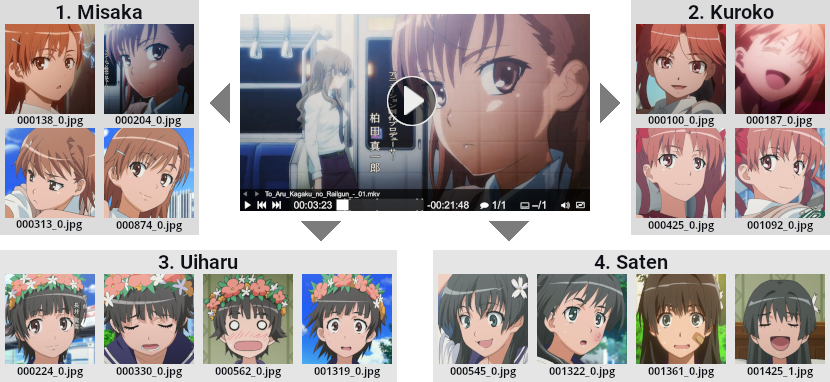

A Python library that takes a video file and outputs pictures of faces grouped by a person/character. Works on live-action and anime footage. Uses pretrained Torch models for face detection and recognition.

Customization options include: 
- for inputs: processing one file, a folder with files filtered by extensions or a custom list of files provided in a .txt;
- for video reading: controlling the step, processing only a certain segment or an area, using GPU video decoding;
- for detection: filtering based on score/size, checking for duplicates, expanding the sizes to get heads or portraits;
- for grouping: performing either classification based on reference images or automatic K-means clustering;
- for fine-tuning: saving intermediate results (e.g. frames with boxes drawn on them) and logs for closer inspection.

### Table of Contents
- [Basic Usage](#basic-usage)
- [Examples](#examples)
- [Models](#models)
- [Parameters](#parameters)
- [Application](#application)
- [Bonus](#bonus)

## Basic Usage
[](https://colab.research.google.com/github/nsndp/video-to-faces/blob/main/demo.ipynb)

Downloading the code and installing (a typical editable install):
```
git clone 'https://github.com/nsndp/video-to-faces.git'
pip install -e video-to-faces
```
Calling from the command line:
```
python -m videotofaces --help
python -m videotofaces -i 'input.mp4' -s 'anime'
```
Or from inside Python code:
```python
from videotofaces import video_to_faces
video_to_faces('input.mp4', style='anime')
```

## Examples
Process a single video. A folder named "faces" will be created alongside it with subfolders "0" to "N" (each representing a group, with the number of groups N+1 selected automatically) and resulting images `FFFFFF_I.jpg` inside them, where "FFFFFF" is a zero-padded frame index and "I" is a 0-based face index within that frame.
```
python -m videotofaces -i 'video.mkv' -s 'live'
```
Process every MKV or MP4 file inside "/content/videos", save the output under "/content/output" and prefix every image name with "vid", resulting in files `vidKK_FFFFFF_I.jpg`, where "KK" is a 2-digit 1-based index of the input file.
```
python -m videotofaces -i '/content/videos' -e 'mkv;mp4' -o '/content/output' -op 'vid' -s 'live'
```
Perform detection and grouping stages separately. Equivalent to calling the very first example above. After the first command, the resulting images will be unsorted and placed directly in "faces".
```
python -m videotofaces -i 'video.mkv' -s 'live' -m 'detection'
python -m videotofaces -i 'video.mkv' -s 'live' -m 'grouping'
```
Perform detection on video.mkv from 2:00 to 4:00 (i.e. 2 minutes), taking a frame every 0.25 seconds (i.e. every 15th frame if it's 60fps), ignoring 20px above and below (maybe you have black bars there), using [Decord](https://github.com/dmlc/decord) library for video reading instead of the default [OpenCV](https://pypi.org/project/opencv-python) (might be faster in some cases).
```
pip install decord
python -m videotofaces -i 'video.mkv' -s 'live' -m 'detection' \
  --video-step 0.25 --video-fragment 2 4 --video-area 0 20 1280 700 --video-reader 'decord'
```
Perform detection on video.mkv using MTCNN on GPU with a batch size of 16. Reject every box with a score lower than 0.2, size smaller than 20px, or positioned closer than 10px to any of the frame's borders. Expand box borders to roughly include full heads, especially at the top so that hair/hats/etc would always fit in, and then further expand a shorter dimension so that every image is a square.
```
python -m videotofaces -i 'video.mkv' -s 'live' -m 'detection' -d 'cuda:0' \
  --det-model 'mtcnn' --det-batch-size 16 --det-min-score 0.2 --det-min-size 20 \
  --det-min-border 10 --det-scale 1.2 1.2 2 1.2 --det-square
```
Perform detection on video.mkv while saving logs, rejects, duplicates and frames with drawn boxes into the "intermediate" folder alongside "faces". Mark a face as duplicate if its hash difference with some other face is <=2.
```
python -m videotofaces -i 'video.mkv' -s 'live' -m 'detection' \
  --save-frames --save-rejects --save-dupes --hash-thr 2
```
Process video.mkv while using ViT-L16 model with a batch size of 128 for getting embeddings for grouping. Remove 10% off every side before passing an image into the encoder. Mark an image as duplicate if its embedding's distance to some other image is <=0.2.
```
python -m videotofaces -i 'video.mkv' -s 'anime' --enc-model 'vit_l' \
  --enc-batch-size 128 --enc-area 0.1 0.1 0.9 0.9 --enc-dup-thr 0.2
```
Process video.mkv while classifying images into predefined groups instead of clustering them. "/content/dir" must contain N subfolders named as groups, each with a single reference image for that group inside. An image will be assigned to a class with the closest embedding distance to its reference, unless every distance is >=0.8, then it'll be assigned to "other" class. Save "log_classification.csv" file in "faces" with exact distance numbers.
```
python -m videotofaces -i 'video.mkv' -s 'anime' --group-mode 'classification' \
  --ref-dir '/content/ref' --enc-oth-thr 0.8 --group-log
```
Process video.mkv and try clustering results into 2, 3, 4, 5 or 6 groups, then choose the number of groups with the best silhouette score. Save "log_clustering.csv" file in "faces" with exact scores for closer examination.
```
python -m videotofaces -i 'video.mkv' -s 'anime' --group-mode 'clustering' \
  --clusters '2-6' --group-log
```
Process video.mkv and cluster images into 2, 4 and 6 groups, saving every grouping under "faces/G2", "faces/G4" and "faces/G6" respectively for manual perusal instead of automatically choosing the best one.
```
python -m videotofaces -i 'video.mkv' -s 'anime' --group-mode 'clustering' \
  --clusters '2,4,6' --clusters-save-all
```

## Models
The weights are downloaded automatically and placed to `<repo root directory>/weights` upon the first call to the respective model, so please do plan for some free disk space accordingly.

<table>
	<thead>
        <tr>
		    <th>Style</th>
            <th>Task</th>
            <th>Architecture</th>
			<th>Weights file</th>
			<th>Source</th>
        </tr>
    </thead>
    <tbody>
		<tr>
			<td rowspan="3">Live</td>
            <td rowspan="2">Detection</td>
			<td>YOLOv3</td>
			<td>235 MB</td>
			<td><a href="https://github.com/msprITU/YOLOv3-Face">YOLOv3-Face</a> by <strong>msprITU</strong></td>
		</tr>
        <tr>
            <td>MTCNN</td>
			<td>1.9 MB</td>
			<td rowspan="2"><a href="https://github.com/timesler/facenet-pytorch">Face Recognition Using Pytorch</a> by <strong>timesler</strong></td>
        </tr>
        <tr>
            <td>Embedding</td>
			<td>Inception Resnet V1</td>
			<td>107 MB (VGGFace2) or 111 MB (CASIA-Webface)</td>
        </tr>
        <tr>
            <td rowspan=2>Anime</td>
            <td>Detection</td>
			<td>Faster R-CNN</td>
			<td>158 MB</td>
			<td><a href="https://github.com/hysts/anime-face-detector">Anime Face Detector</a> by <strong>hysts</strong></td>
        </tr>
        <tr>
            <td>Embedding</td>
			<td>Vision Transformer</td>
			<td>336 MB (ViT-B16) or 1.19 GB (ViT-L16)</td>
			<td><a href="https://github.com/arkel23/animesion">Animesion</a> by <strong>arkel23</strong></td>
        </tr>
    </tbody>
</table>

Other sources were considered (like [InsightFace](https://github.com/deepinsight/insightface)'s variety of models or [AnimeHeadDetector](https://github.com/grapeot/AnimeHeadDetector)), but after some testing these seemed to show the best results for this specific task.

Big thanks to the original authors for doing the work and making it freely available.

## Parameters
The same descriptions can be obtained by calling `python -m videotofaces --help`.

If you're making the calls from inside Python code, all parameters are named the same, except the first two symbols (`--`) are omitted, and every dash (`-`) is changed to underscore (`_`), e.g.:
- `--video-step` -> `video_step`
- `--det-min-score` -> `det_min_score`

**-i, --input-path PATH**<br/>
Path to a video file, a directory with video files, or a .txt file with full paths inside.

**-e, --input-ext EXTENSIONS**<br/>
If -i is a directory, process only files with this extension. Can contain multiple extensions separated by a semicolon.

**-o, --out-dir PATH**<br/>
Path to the output directory. A folder named "faces" (and, if needed, "intermediate") will be created under it. Assumed to be the same as the input directory if omitted.

**-op, --out-prefix TEXT**<br/>
A prefix to add to every resulting image. Full naming will be "\[prefix\]\[k\]\_\{f\}\_\{i\}.jpg", where {f} is a video's frame number from the start, {i} is a face number within that frame, and [k] is a 1-based index of the video in the input folder/list (absent if input is a single video).

**-s, --style TEXT**<br/>
Whether the inputs are anime or live-action. Accepted values: "live", "anime". Necessary for choosing the proper Torch models.

**-m, --mode TEXT**<br/>
Accepted values: "full", "detection", "grouping" (the default is "full", which is equivalent to calling "detection", then "grouping"). When using "grouping", specify either -o with face images or the same -i that was used during detection.

**-d, --device TEXT**<br/>
Whether to use CPU or GPU for Torch models when detecting/grouping. Accepts everything that [torch.device](https://pytorch.org/docs/stable/tensor_attributes.html#torch.device) accepts. Defaults to "cuda:0" if a GPU is available and to "cpu" otherwise.

**--save-frames**<br/>
Save every processed video frame to "<--out-dir>/intermediate/frames" for closer examination of the detector's performance. Boxes will be drawn around detected faces either in green (passed) or red (rejected), and the score (i.e. the detector's confidence for this particular face) will be written for each box. The frames will be saved with lower JPG quality (50%) and downscaled to fit into a 1024x1024px box if necessary to avoid eating too much disk space.

**--save-rejects**<br/>
Save every detected but rejected face (which will happen if it's smaller than --det-min-size, has lower score than --det-min-score or positioned closer to a frame border than --det-min-border) to "<out_dir>/intermediate/rejects" for closer examination. A file named "log_rejects.csv" will also be created at "intermediate", detailing the exact compared values for each rejected file.

**--save-dupes**<br/>
Save every face that was detected but marked as duplicate to "<--out-dir>/intermediate/dupesN", along with a log file "log_dupesN.csv", where N will be 1, 2 or 3 depending on the dup-checking part (see --hash-thr for more about parts 1-2 and --enc-dup-thr for more about part 3).

**--video-step SEC**<br/>
Controls the interval (in seconds) at which video frames are taken for detection. The default is 1, i.e. every second (meaning every 30th frame for 30fps video, for example). Adjust this depending on how fast-changing your videos are.

**--video-fragment MIN MIN**<br/>
Process only the specified segment of the input video. Expects two space-separated values in minutes, e.g. "1 1.5" will mean to only detect faces from 60 sec to 90 sec mark.

**--video-area PX PX PX PX**<br/>
Process only the specified rectangle area of the input video. Expects four space-separated values in pixels (x1, y1, x2, y2), where (x1, y1) is the top-left corner and (x2, y2) is the bottom-right corner (with the top-left frame corner being (0, 0)). Helpful if you have a video with black bars (or some other background where faces never appear) to avoid seeing parts of them in results and also to save a bit on processing time. E.g. if a typical 1080p video has full-width, 140px-height black bars above and below, "0 140 1920 940" will exclude them.

**--video-reader TEXT**<br/>
Which library to use for video reading. Accepted values: "opencv", "decord". The default is "opencv", since Python's cv2 is required for image manipulation anyway, but you need "decord" if you want to use GPU for video reading (and have [decord](https://github.com/dmlc/decord) with GPU support installed). If your CPU/GPU difference is big enough (like in Google Colab VMs), video reading is likely to become a big bottleneck, so it might be worth going through the trouble to choose the latter. Note that -d only affects Torch models and will have no effect here: for "decord", it will use GPU if possible and CPU otherwise; for "opencv", it will always use CPU (enabling GPU decoding for OpenCV was too much of a black magic for me).

**--det-model TEXT**<br/>
Which Torch model to choose for face detection. Accepted values: "yolo", "mtcnn" when -s="live"; "rcnn" when -s="anime". MTCNN might be a better choice if you're strapped for resources, but otherwise you might as well just leave this param undefined, which defaults to "yolo" and "rcnn" respectively.

**--det-batch-size INT**<br/>
How many frames to process at once when detecting faces. The default is 4. A bigger batch usually leads to faster results, but a batch too large will simply crash "after using all available RAM/VRAM". Can vary greatly depending on your hardware, but since input images are usually much larger for detection than for embedding (e.g. 608px or 1333px vs 192x192 or 128x128), this number is likely to be much smaller than --enc-batch-size.

**--det-min-score FLOAT**<br/>
Reject every face with a score (i.e. confidence metric as reported by the detection model) lower than this. Increase to filter out more false positives, decrease to detect as much as possible. The default is 0.4. Might be worth adjusting for a specific video after doing a "test pass" while setting --save-frames and examining frames with green/red boxes drawn on them (the same recommendation applies to --det-min-size and --det-min-border).

**--det-min-size PX**<br/>
Reject every face where either width or height (in pixels) is smaller that this. The default is 50. Detectors will get more false positives at smaller sizes, so might be worth adjusting in conjunction with --det-min-score. Note that enlargement from --det-scale happens after and thus has no effect here, i.e. the size check is against the raw boxes as returned by the detector model.

**--det-min-border PX**<br/>
Reject every face where any border is closer to a frame's border (in pixels) that this. The default is 5. Helpful for filtering out partial faces that continue off-screen, because detector's boxes for those will either be at the very border or go into negative space as well.

**--det-scale N N N N**<br/>
Enlarge every detected face area using four scale factors (SL, SR, SU, SD): the left border will become SL times more distant from the image's center, the right border - SR times more distant, the upper border - SU times, the bottom border - SD times. Useful if you need heads or portraits rather than tightly-cropped faces. The default is "1.5 1.5 2.2 1.2", which usually translates into a decent portrait crop (especially for anime where hair and headwears are very important parts of characters, hence a bigger scale factor for the upper border), though it's really worth to play with these numbers for a particular video/detection model. Scale factors lower than 1 will mean contraction instead of expansion. Set to "1 1 1 1" if you want to keep detected boxes as-is.

**--det-square**<br/>
Enlarge every detected face area so that the resulted image is a square. This happens after the enlargement from --det-scale. Note that if a face is close to the frame's border, the resulting area will be moved accordingly so it doesn't go overboard, meaning that any border faces might get visibly non-centered with this option.

**--hash-thr INT**<br/>
Controls the strictness of the duplicate check, i.e. whether the current face image is similar enough to any previous face image (if it does, it's marked as a duplicate and not included in the final results). Higher numbers mean bolder marking, i.e. 0-2 will mark only near-identical images, while 12-16 will spot more but lead to some false positives as well (the default is 8; set as -1 to remove the check altogether). The number's precise meaning is the difference between the images' average hashes (which are more reliable compared to perceptual hashes of diff hashes, despite being the simplest ones), and the check happens in two parts, with part 1 comparing only to the previous 5 faces (since this is where most duplicates will show up in most videos, with scenes rarely changing every single second and all) and part 2 doing a second pass by comparing every remaining pair. Set --save-dupes and explore the logs if you want to fine-tune this parameter.

**--enc-model TEXT**<br/>
Which Torch model to choose for getting image embeddings used in grouping. Accepted values: "facenet_vgg", "facenet_casia" when -s="live"; "vit_b", "vit_l" when -s="anime". Facenet VGG is marginally more precise than CASIA; VIT-L is moderately better than VIT-B but has a much larger weight file (1.19 GB vs 336 MB). Defaults to "facenet_vgg" and "vit_b" respectively.

**--enc-batch-size INT**<br/>
How many images to process at once when getting the faces' embeddings for grouping. The default is 16. A bigger batch usually leads to faster results, and since the inputs here are much smaller than for detectors, it'll probably be safe to set a much higher number on good hardware (e.g. 128 or 256).

**--enc-area N N N N**<br/>
Allows to use only a certain rectangular area of face images to calculate their embeddings. Defined in decimals from 0 to 1 as (px1, py1, px2, py2), where (px1, py1) and (px2, py2) are the top-left and bottom-right corner of the area respectively (e.g. "0.2 0.1 0.8 0.9" for a 100x100px image would cut off 20 pixels from left and right + 10 pixels from top and bottom before passing it to the encoder model). It can help to set this as an inverse of --det-scale, because while you might prefer to have heads or portraits for saving, encoders could still perform better on raw tightly-cropped faces. The default is None, i.e. use images for embedding as-is.

**--enc-dup-thr FLOAT**<br/>
Controls the strictness of part 3 of the duplicate check, where the faces are compared not by their hashes but by cosine distances between their embeddings (and every face that's closer than this number to some other face is marked as a duplicate and not included in the final results). Higher numbers mean bolder marking. The default is 0.25. Set to -1 to disable part 3 altogether. Set --save-dupes and explore the logs if you want to fine-tune this parameter.

**--group-mode TEXT**<br/>
Accepted values: "clustering", "classification" (the default is "clustering"). The former would group the faces automatically using K-means clustering (a less reliable but more convenient option); the latter would sort them into pre-defined groups based on reference images provided at --ref-dir (a more precise option that requires extra prep).

**--clusters TEXT**<br/>
If --group-mode="clustering", this controls how many groups (clusters) you will get. Can be a single number, a comma-separated list of numbers or a range defined as "FROM-TO". For more than one number, every option will be checked, and the one with the highest silhouette score (i.e. most well-defined clusters) will be selected (unless --clusters_save_all is specified). The default is "2-9". The results will appear under "<--out-dir>/faces/<N>", where N is the cluster's 0-based index.

**--clusters-save-all**<br/>
If --group-mode="clustering" and --clusters is more than one number, this will save grouping results for every possible cluster count under "<--out-dir>/faces/G<K>" so you can choose the best one manually instead of just relying on silhouette score. E.g. for 50 detected faces and --clusters="2,4,7" you will then have folders "G2","G4","G7" with 50 images each, split under subfolders "0","1"; "0","1","2","3" and "0","1","2","3","4","5","6" respectively.

**--random-state INT**<br/>
If --group-mode="clustering", this is a random state value as passed to sklearn KMeans function. The default is 0. Any value besides None will lead to reproducible results (for that particular value), i.e. exactly the same clustering outputs every time it is applied to the same input.

**--ref-dir PATH**<br/>
If --group-mode="classification", this needs to be a path to a folder with multiple subfolders (their names will become class names to group into), each with a single reference image inside. Every face will be assigned to a class with the closest ref image, where "the closest" is defined as "having the shortest cosine distance between their embeddings" (unless --enc-oth-thr is not -1, then there'll also be a class named "other"). Can be omitted if you have an appropriate "ref" folder inside --out-dir.

**--enc-oth-thr FLOAT**<br/>
If --group-mode="classification", a face will be assigned to "other" class if its distance to every ref image is larger than or equal to this number. The default is 0.9. Set to -1 to exclude "other" class completely.

**--group-log**<br/>
Save a log file ("log_clustering.csv" or "log_classification.csv" depending on --group-mode) under "<--out-dir>/faces" with details of the grouping process for closer examination.

## Application
¯\\\_(ツ)\_/¯

I initially started this when playing with [TWDNE](https://gwern.net/twdne) (remember when StyleGAN2 was all the rage? Yeah, me neither) to have a convenient tool for extracting a lot of portrait-style character images from anime videos. Then I got way too thorough with selecting good Torch models for the job, wanting to have them clean, organized and written with minimal dependencies instead of just using a bunch of other people's projects as black boxes (which led to the neighboring repo [Tidy Torch Models](https://github.com/nsndp/tidy-torch-models)). Then I thought about how anime face detection doesn't even have a go-to dataset like [WIDER Face](http://shuoyang1213.me/WIDERFACE) for training or proper evaluation and decided to gather one while iterating on the current models (leading to [Labeled Animation Posters](https://github.com/nsndp/labeled-animation-posters), also nowhere near complete).

You could say this was a classic hobbyist descent into the rabbit hole of ML, repeatedly getting out of scope and distracted with details without finishing anything. Except that, after another year or so, I decided to come back to at least get this collection of stuff sorted out and documented. But since nobody's needed cropped face datasets to train generative models for years now, the original purpose of this library has been lost in time.

I guess it could still be helpful for collecting or documenting purposes. For example, if you're making a wiki about a TV show or an anime series, you might appreciate having at hand a lot of cropped faces/portraits directly from the sources at hand.

## Bonus
If you're on desktop, you probably won't have any trouble with quickly looking through the results using a standard file explorer. But if you're inside Google Colab or some other cloud-based Jupyter Notebook, there's a couple of helper functions included.

One for image browsing:
```python
from videotofaces import image_gallery
# display all images from a folder along with the filenames (default height is 150px)
image_gallery('faces', height=120)
# display images no. 21 to 40 (sorted by filename, page count is zero-based)
image_gallery('faces', page_size=20, page_number=1)
# display images from every subfolder, separated by titles
image_gallery('faces', subfolders=True)
```
<!-- https://www.stefanjudis.com/notes/how-to-define-dark-light-mode-images-in-github-markdown/ -->


And one for examining logs with images embedded into a table using [pandas](https://pypi.org/project/pandas/):
```python
from videotofaces import dataframe_with_images
# show log info for the images that were rejected due to their low score
dataframe_with_images('log_rejects.csv', 'videos', filter=('too_low(mscore=0.4)', 1, 1))
# show image pairs that had a hash difference from 4 to 16 during part 2 of the dup check
dataframe_with_images('log_dupes2.csv', 'videos', filter=('hash_diff', 4, 16))
# show all image pairs from part 3 of the dup check, sorted by distance in ascending order
dataframe_with_images('log_dupes3.csv', 'videos', sort_by='distance')
```

